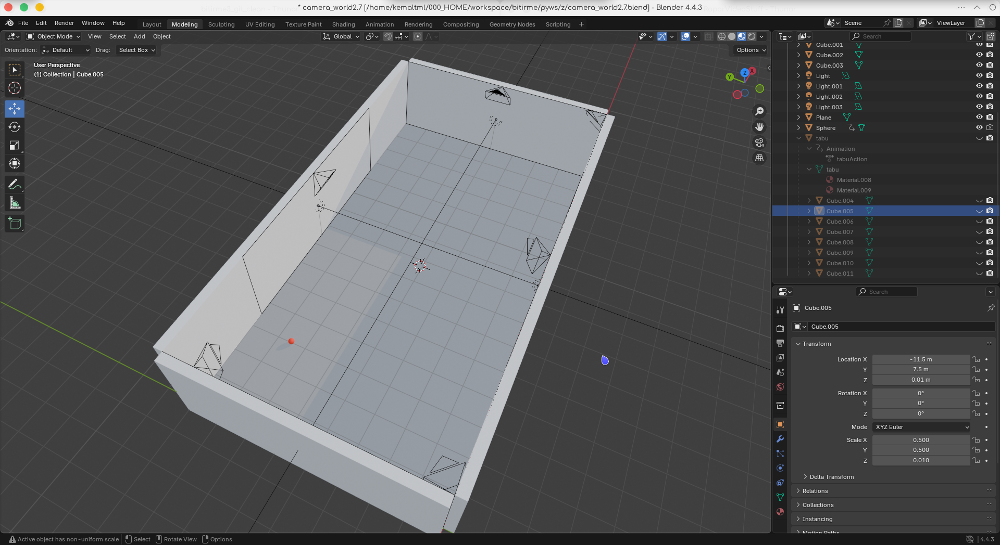
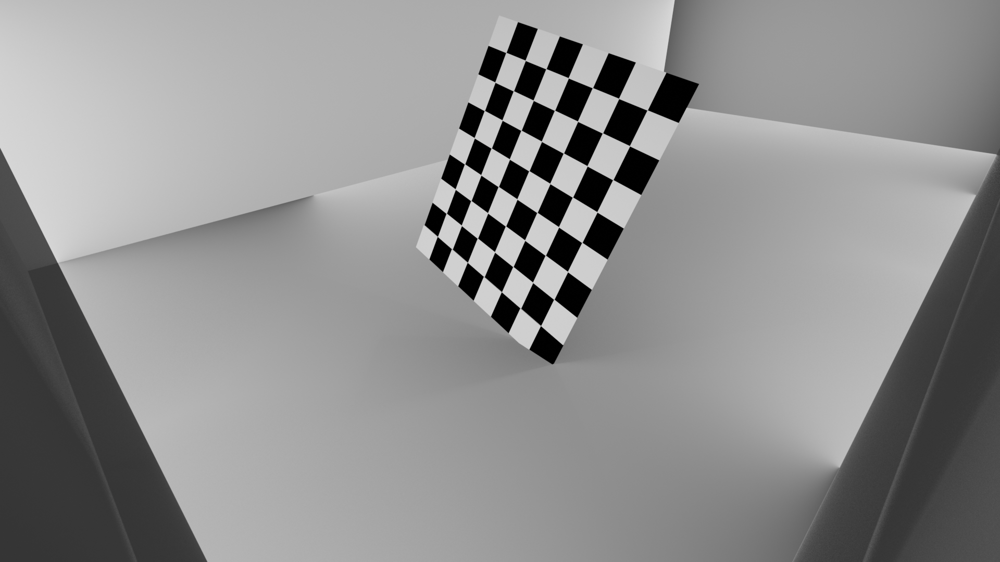
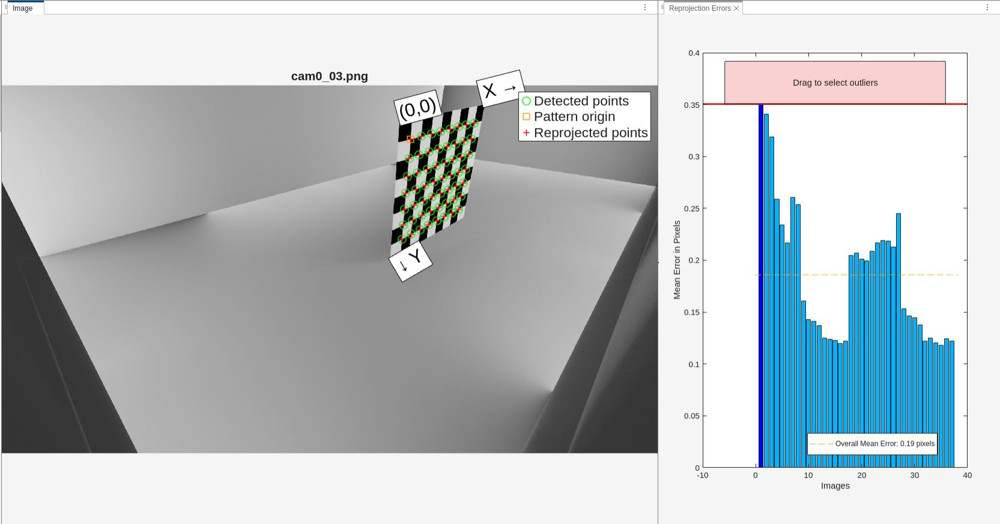

# Yöntem
## Hazırlık
### Simülasyon Ortamının Hazırlanması
Çalışmalara öncelikle bilgisayar ortamında simülasyon yaparak yapay verilerle başlanması kararlaştırıldıkran sonra gerekli sistemi simüle edip, fotoğraf ve video kaynağı elde edebilmek için blender uygulamasından Şekil 1'de görüldüğü gibi 6 kameralı bir oda ortamı oluşturuldu.

"report_datas/blender.png"

Oluşturulan ortamda kamera kalibrasyon aşaması için 9x8 boyutunda ve her kare 30cm boyutunda siyah beyaz renklerinde damalı nesne oluşturuldu. Şekil 2'de blender ortamındaki kamerada damalı nesne görülebilir.

"inputs/calibrationPhotos/single/cam_0/cam0_30.png"

Oluşturulan damalı zemin, farklı koordinatlar ve açılarda her kamera için 40'ar adet olacak şekilde fotoğraf oluşturmak için kullanılmıştır. Bu fotoğraflar kullanılarak her kamera matlab uygulaması içerisindeki kamera kalibrasyon eklentisi kullanılarak tek tek kalibre edilmiş ve sonuçları ve verileri daha sonra kullanmak için kaydedilmiştir. Kalibrasyon işleminin amacı kameraya ait odak uzaklığı, optik merkez, radyal bozulma, teğetsel bozulma ve piksel ölçeğinde sapma değeri elde etmektir. 

### Kamera Kalibrasyonu
Odak uzaklığı, kamera merceğinin görüntü düzlemine (sensöre) olan uzaklığıdır. Dünya üzerindeki bir noktanın görüntü üzerindeki büyüklüğünü etkiler. Kalibrasyon işlemi sonucu x yönünde ve y yönünde olacak şekilde 2 değer vektör matrisi olarak elde edilir ve içsel (intrinsic) matrisinde saklanır.

Optik merkez, görüntünün orta noktasının koordinatlarını barındırır. Görüntünün merkez koordinatları olarak varsayılsa da hata payı mevcuttur ve kalibrasyon sonucu bu hata hesaplanıp gerçek merkez koordinatları elde edilip içsel matrisinde saklanır. 

Radyal bozulma, kameranın dikey eksenlerinde oluşan ve merkezden uzaklaştıkça artan görüntü bozulasıdır. Kalibrasyon sonucu aşağıda görünen formüldeki $k_1$, $k_2$ ve $k_3$ katsayıları hesaplanır.

$$
\begin{align*}
x_{distorted} &= x(1 + k_1r^2 + k_2r^4 + k_3r^6)\\
y_{distorted} &= y(1 + k_1r^2 + k_2r^4 + k_3r^6)\\
\end{align*}
$$

Formülde kullanılan $r^2$ değeri merkezden uzaklığı ifade eder ve $x^2 + y^2$ şeklinde koordinatların kareleri toplanarak elde edilir.

Teğetsel bozulmai görüntü üzerindeki bozulmalar eksenlere paralel olmadığı durumlarda oluşan görüntü bozulmasına verilen isimdir. Kalibrasyon sonucu aşağıda görülen formüldeki $p_1$ ve $p_2$ katsayıları elde edilir.

$$
\begin{align*}
x_{distorted} &= x + [2p_1xy + p_2(r^2 + 2x^2)]\\
y_{distorted} &= y + [p_1(r^2 + 2y^2) + 2p_2xy]
\end{align*}
$$

Buradaki $p_1$ ve $p_2$ değerleri mercek kaymasından kaynaklı asimetrik bozulma bilgisini taşır.

Sapma değeri, kalibrasyonun doğruluğunu belirtir. Kalibrasyon sonucunda elde edilen 3B noktaların 2B görüntüde projeksiyondan ne kadar sapma olduğunu belirtir. RMS (Karekök Ortalama Kare Hatası) olarak ifade edilir. Gerçek dünyadaki 3B sonucu tahmin edilen $\hat{x}$ ve $\hat{y}$ değerlerinin gerçek görüntüdeki $x$ ve $y$ değerleri kullanılarak  

$$
e_i = \sqrt{(x_i - \hat{x})^2 + (y_i - \hat{y})^2}
$$

şeklinde hesaplanır. Tüm noktalar için ise

$$
RMS = \sqrt{\frac{1}{N} \sum_{i=1}^N e_i^2}
$$

formülü kullanılarak bu hata payı hesaplanır.

Şekil 3'de kalibrasyon sonucu ve hata payı görülebilir. Kalibrasyon sonucu kameranın odak uzaklığı, optik merkez, radyal bozulma, teğetsel bozulma ve piksel ölçeğinde sapma değeri elde edilmiştir. 

report_datas/camera_calibration.png

Hesaplanan değerler Tablo 1'de görülebilir.

Tablo 1: kalibrasyon sonucu elde edilen kamera içsel değerleri

|Parametre|Değer|Açıklama|
|---------------------------|-----|--------|
|Odak Uzaklığı ($f_x$, $f_y$)|(959.1, 961,03)|Piksel cinsinden|
|Optik Merkez ($c_x$,$c_y$)|(955.32, 539,36|Piksel Cinsinden|
|Radyal Bozulma | \[0.0053, 0.0053\] | Merkeze uzaklıkla bozulma|
|Teğetsel Bozulma| \[0, 0\] | Merkez dışı kayma|
|Sapma Değeri | 0.1859 | RMS cinsinden hata değeri|

Elde edilen bu değerler intrinsic matrisi adı verilen bir yapıda saklanarak kullanılır. Bu matris şu şekilde oluşturulur:

$$
\begin{bmatrix}
f_x & 0   & c_x \\
0   & f_y & c_y \\
0   & 0   & 1
\end{bmatrix}
$$

### Rotasyon, Transformasyon ve Projeksiyon Matrisi 
**Rotasyon Matrisi**

Bir vektörün veya şeklin 3 boyutlu bir uzayda eksenler etrafında dönme değerlerini barındıran matristir. Rotasyon matrisi her eksen için hesaplanan matrislerin çarpılmasıyla hesaplanmaktadır. Bu matrislerin hesaplama adımları aşağıda belirtilmiştir.

$$
R_x =
\begin{bmatrix}
1    & 0    & 0\\
0    & cos(\theta) & -sin(\theta)\\
0    & sin(\theta) & cos(\theta)
\end{bmatrix}
$$

$$
R_y =
\begin{bmatrix}
cos(\theta) & 0 & sin(\theta)\\
0 & 1 & 0\\
-sin(\theta) & 0 & cos(\theta)
\end{bmatrix}
$$

$$
R_z =
\begin{bmatrix}
cos(\theta) & -sin(\theta) & 0\\
sin(\theta) & cos(\theta) & 0\\
0 & 0 & 1
\end{bmatrix}
$$

$$
R = R_z(\theta_z) \cdot R_y(\theta_y) \cdot R_x(\theta_x) 
$$

**Transformasyon Matrisi**

Bir vektörün 3 boyutlu uzayda bir noktadan başka bir noktaya nasıl taşındığı hakkında bilgiyi saklar. 4x4 boyutundaki matrisin yapısı aşağıdaki gibidir.

$$
T =
\begin{bmatrix}
R_{s11}&R_{s12}&R_{s13} & T_{s1}\\
R_{s21}&R_{s22}&R_{s23} & T_{s2}\\
R_{s31}&R_{s32}&R_{s33} & T_{s3}\\
0&0&0&1
\end{bmatrix}
$$
Burada $R_s$ rotasyon matrisini, $T_s$ translasyon matrisini temsil etmektedir. Translasyon matrisini hesaplamak için $T_s = -R_s \cdot C$ formülü kullanılır. Bu formüldeki $C$ kameranın pozisyonunu içeren 3x1 boyutundaki sütun matrisidir. Hesaplanan bu matris her kameranın merkez olarak kabul edilen noktaya göre nerede ve hangi açıda bulunduğu bilgisini içermektedir. Hesaplamaların ardından simülasyon ortamında kameraların görüntüsü Şekil 4'de görülebilir.

**Projeksiyon Matrisi**

3 boyutlu bir noktanın 2 boyutlu bir görüntü düzleminde nasıl projekte edileceğini belirten bir matristir. Kameranın kalibrsayon sonucu elde edilen intrinsic matrisiyle transformasyon matrisinin çarpımı sonucu elde edilir. x, y, ve z konumundaki A noktasının görüntü düzlemindeki karşılığı A' şu şekilde hesaplanır:

$$
\text{noktanın 3 boyuttaki koordinatları}\\
A = 
\begin{bmatrix}
x\\y\\z\\1 
\end{bmatrix}\\
$$

$$
P = K \cdot [R|T]
$$

$$
A' = P \times A
$$

Hesaplanan bu matris iki kamera kullanılarak dünya üzerindeki noktanın görüntülerde oluşan koordinatları kullanılarak dünya üzerindeki koordinatını bulmamızı sağlayacak.
