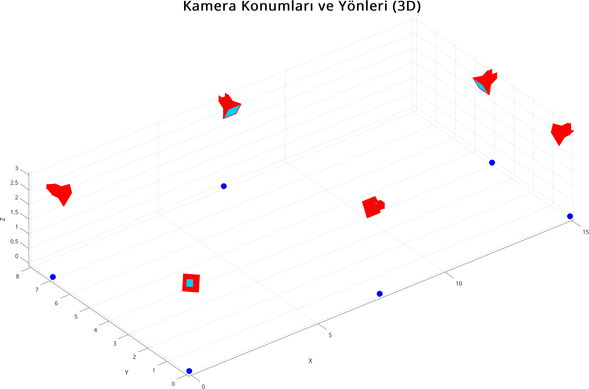
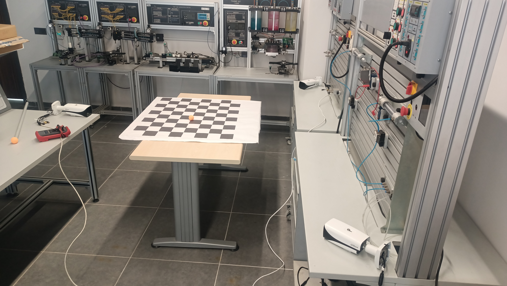

# Yöntem
## Hazırlık
### Simülasyon Ortamının Hazırlanması
Algoritma geliştirme ve yöntem belirlemek amacıyla sanal bir ortamda çalışmalara başlanmıştır. Bu sanal ortam Blender ve MATLAB uygulaması kullanılarak oluşturulmuş ve kullanılmıştır. İhtiyaç duyulan fotoğraf ve video kaynaklarını sağlamak için blender uygulamasında x ekseninde 15 metre, y ekseninde 8 metre ve z ekseninde 3 metre boyutlarında bir oda oluşturulmuştur. Odanın etrafına belirli açılar ve konumlarda, yükseklikleri 3 metre olacak şekilde 6 kamera eklenmiştir. Oluşturulan ortam Şekil 1'de görülmektedir.

Projenin ilerlemesi için kameraların kalibre edilip odak uzaklığı, bozulmalar gibi içsel değerlerin elde edilebilmesi için Zhang’s kalibrasyon metodu (cites/cameraCalibration.pdf) kullanılması kararlaştırılmıştır. Bu metod damalı bir zeminin farklı oryantasyonlarda fotoğrafları çekilerek yapılmaktadır. Bunun için blender uygulamasında 9x8 kare boyutlarında ve her karenin bir kenarı 30cm olacak şekilde siyah-beyaz bir nesne oluşturulmuştur. Oluşan görüntü Şekil 2'de görülebilir.

\newpage

Oluşturulan damalı zemin, farklı koordinatlar ve açılarda her kamera için 40'ar adet olacak şekilde fotoğraf oluşturmak için kullanılmıştır. Bu fotoğraflar kullanılarak her kamera MATLAB uygulaması içerisindeki kamera kalibrasyon eklentisi kullanılarak tek tek kalibre edilmiş ve sonuçları ve verileri daha sonra kullanmak için kaydedilmiştir. Kalibrasyon işleminin amacı kameraya ait odak uzaklığı, optik merkez, radyal bozulma, teğetsel bozulma ve piksel ölçeğinde sapma değeri elde etmektir. 

(The MathWorks, Inc. **camera calibration**, MATLAB Documentation, [Online]. Available: https://www.mathworks.com/help/vision/camera-calibration.html (Accessed: 15 June 2025))

### Kamera Kalibrasyonu
Odak uzaklığı, kamera merceğinin görüntü düzlemine (sensöre) olan uzaklığıdır. Dünya üzerindeki bir noktanın görüntü üzerindeki büyüklüğünü etkiler. Kalibrasyon işlemi sonucu x yönünde ve y yönünde olacak şekilde 2 değer vektör matrisi olarak elde edilir ve içsel (intrinsic) matrisinde saklanır. (cites/Intrinsics.pdf)

Optik merkez, görüntünün orta noktasının koordinatlarını barındırır. Görüntünün merkez koordinatları olarak varsayılsa da hata payı mevcuttur ve kalibrasyon sonucu bu hata hesaplanıp gerçek merkez koordinatları elde edilip içsel matrisinde saklanır. 

Radyal bozulma, kameranın dikey eksenlerinde oluşan ve merkezden uzaklaştıkça artan görüntü bozulasıdır. Kalibrasyon sonucu aşağıda görünen formüldeki $k_1$, $k_2$ ve $k_3$ katsayıları hesaplanır.

$$
\begin{aligned}
x_{distorted} &= x(1 + k_1r^2 + k_2r^4 + k_3r^6)\\
y_{distorted} &= y(1 + k_1r^2 + k_2r^4 + k_3r^6)\\
\end{aligned}\\
\text{(1)}
$$

Formülde kullanılan $r^2$ değeri merkezden uzaklığı ifade eder ve $x^2 + y^2$ şeklinde koordinatların kareleri toplanarak elde edilir.

Teğetsel bozulma görüntü üzerindeki bozulmalar eksenlere paralel olmadığı durumlarda oluşan görüntü bozulmasına verilen isimdir. Kalibrasyon sonucu aşağıda görülen formüldeki $p_1$ ve $p_2$ katsayıları elde edilir.

(The MathWorks, Inc. **camera parameters**, MATLAB Documentation, [Online]. Available: https://www.mathworks.com/help/vision/ref/cameraparameters.html (Accessed: 22 June 2025))

$$
\begin{aligned}
x_{distorted} &= x + \big[2p_1xy + p_2(r^2 + 2x^2)\big]\\
y_{distorted} &= y + \big[p_1(r^2 + 2y^2) + 2p_2xy\big]
\end{aligned}\\
\text{(2)}
$$

Buradaki $p_1$ ve $p_2$ değerleri mercek kaymasından kaynaklı asimetrik bozulma bilgisini taşır.

Sapma değeri, kalibrasyonun doğruluğunu belirtir. Kalibrasyon sonucunda elde edilen 3B noktaların 2B görüntüde projeksiyondan ne kadar sapma olduğunu belirtir.(RE_RMSE.pdf) RMSE (Karekök Ortalama Kare Hatası) olarak ifade edilir. Gerçek dünyadaki 3B sonucu tahmin edilen $\hat{x}$ ve $\hat{y}$ değerlerinin gerçek görüntüdeki $x$ ve $y$ değerleri kullanılarak  

$$
\begin{aligned}
e_i = \sqrt{(x_i - \hat{x})^2 + (y_i - \hat{y})^2}
\end{aligned}\\
\text{(3)}
$$

şeklinde hesaplanır. Tüm noktalar için ise

$$
\begin{aligned}
RMS = \sqrt{\frac{1}{N} \sum_{i=1}^N e_i^2}
\end{aligned}\\
\text{(4)}
$$

formülü kullanılarak bu hata payı hesaplanır.

Şekil 3'de kalibrasyon sonucu ve hata payı görülebilir. Kalibrasyon sonucu kameranın odak uzaklığı, optik merkez, radyal bozulma, teğetsel bozulma ve piksel ölçeğinde sapma değeri elde edilmiştir. 

Hesaplanan değerler Tablo 1'de görülebilir.

Tablo 1: kalibrasyon sonucu elde edilen kamera içsel değerleri

|Parametre|Değer|Açıklama|
|---------------------------|-----|--------|
|Odak Uzaklığı ($f_x$, $f_y$)|(959.1, 961,03)|Piksel cinsinden|
|Optik Merkez ($c_x$,$c_y$)|(955.32, 539,36|Piksel Cinsinden|
|Radyal Bozulma | \[0.0053, 0.0053\] | Merkeze uzaklıkla bozulma|
|Teğetsel Bozulma| \[0, 0\] | Merkez dışı kayma|
|Sapma Değeri | 0.1859 | RMS cinsinden hata değeri|

\newpage

Elde edilen bu değerler intrinsic matrisi(cites/Intrinsics.pdf)(cites/Intrinsics_2.pdf) adı verilen bir yapıda saklanarak kullanılır. Bu matris şu şekilde oluşturulur:

$$
\begin{bmatrix}
f_x & 0   & c_x \\
0   & f_y & c_y \\
0   & 0   & 1
\end{bmatrix}\\
\text{(5)}
$$

### Rotasyon, Transformasyon ve Projeksiyon Matrisi 
**Rotasyon Matrisi**

Bir vektörün veya şeklin 3 boyutlu bir uzayda eksenler etrafında dönme değerlerini barındıran matristir. Rotasyon matrisi her eksen için hesaplanan matrislerin çarpılmasıyla hesaplanmaktadır . Bu matrislerin hesaplama adımları aşağıda belirtilmiştir.

$$
\begin{aligned}
R_x =
\begin{bmatrix}
1    & 0    & 0\\
0    & cos(\theta) & -sin(\theta)\\
0    & sin(\theta) & cos(\theta)
\end{bmatrix}
\end{aligned}
$$

$$
\begin{aligned}
R_y =
\begin{bmatrix}
cos(\theta) & 0 & sin(\theta)\\
0 & 1 & 0\\
-sin(\theta) & 0 & cos(\theta)
\end{bmatrix}
\end{aligned}
$$

$$
\begin{aligned}
R_z =
\begin{bmatrix}
cos(\theta) & -sin(\theta) & 0\\
sin(\theta) & cos(\theta) & 0\\
0 & 0 & 1
\end{bmatrix}
\end{aligned}
$$

$$
\begin{aligned}
R = R_z(\theta_z) \cdot R_y(\theta_y) \cdot R_x(\theta_x) 
\end{aligned}\\
\text{(6)}
$$

**Transformasyon Matrisi**

Bir vektörün 3 boyutlu uzayda bir noktadan başka bir noktaya nasıl taşındığı hakkında bilgiyi saklar. 4x4 boyutundaki matrisin yapısı aşağıdaki gibidir.

$$
\begin{aligned}
T =
\begin{bmatrix}
R_{s11}&R_{s12}&R_{s13} & T_{s1}\\
R_{s21}&R_{s22}&R_{s23} & T_{s2}\\
R_{s31}&R_{s32}&R_{s33} & T_{s3}\\
0&0&0&1
\end{bmatrix}
\end{aligned}\\
\text{(7)}
$$

Burada $R_s$ rotasyon matrisini, $T_s$ translasyon matrisini temsil etmektedir. Translasyon matrisini hesaplamak için $T_s = -R_s \cdot C$ formülü kullanılır. Bu formüldeki $C$ kameranın pozisyonunu içeren 3x1 boyutundaki sütun matrisidir. Hesaplanan bu matris her kameranın merkez olarak kabul edilen noktaya göre nerede ve hangi açıda bulunduğu bilgisini içermektedir. Hesaplamaların ardından simülasyon ortamında kameraların görüntüsü Şekil 4'de görülebilir.

\newpage
**Projeksiyon Matrisi**

3 boyutlu bir noktanın 2 boyutlu bir görüntü düzleminde nasıl projekte edileceğini belirten bir matristir

(J. Cashbaugh and C. Kitts, "Automatic Calculation of a Transformation Matrix Between Two Frames," in IEEE Access, vol. 6, pp. 9614-9622, 2018, doi: 10.1109/ACCESS.2018.2799173.).

Kameranın kalibrsayon sonucu elde edilen intrinsic matrisiyle transformasyon matrisinin çarpımı sonucu elde edilir. x, y, ve z konumundaki $A$ noktasının görüntü düzlemindeki karşılığı $A'$ şu şekilde hesaplanır:

$$
\begin{aligned}
\text{noktanın 3 boyuttaki koordinatları} \quad
A = 
\begin{bmatrix}
x\\
y\\
z\\
1 
\end{bmatrix}\\
\end{aligned}
$$

$$
P = K \cdot \big[R|T\big]
$$

$$
A' = P \times A\\
\text{(8)}
$$

Hesaplanan bu matris iki kamera kullanılarak dünya üzerindeki noktanın görüntülerde oluşan koordinatları kullanılarak dünya üzerindeki koordinatını bulmamızı sağlayacak.

### Obje Tespiti
Takip işlemlerinin yapılabilmesi için öncelikle objenin tespit edilmesi gerekmektedir. Obje tespiti yapabilmek için blender uygulamasında 0.1m çapında turuncu renkli bir top oluşturulup farklı konumlarda fotoğrafları çekilmiştir. Bu fotoğraflar kullanılarak renk maskeleme tekniği kullanılmıştır. 

**Renk Maskeleme**

Dijital görüntü işleme uygulamalarında tanımlı bir renk aralığındaki piksellerin ayrıştırılıp bu bölgelerin analiz edilmesi amacıyla kullanılan bir segmentasyon yöntemidir. Bu işlem için genellikle HSV (renk tonu, doygunluk, renk değeri) veya RGB renk uzayı kullanılmaktadır. Seçilen renk uzayında belirlenen alt ve üst sınır değerleri kullanılarak arada kalan bölgeler tespit edilip siyah beyaz bir görütü edilir. 

(Rastogi, O. (2021). Color Masking Method for Variable Luminosity in Videos with Application in Lane Detection Systems. In: Prateek, M., Singh, T.P., Choudhury, T., Pandey, H.M., Gia Nhu, N. (eds) Proceedings of International Conference on Machine Intelligence and Data Science Applications. Algorithms for Intelligent Systems. Springer, Singapore. https://doi.org/10.1007/978-981-33-4087-9_24)

Renk maskeleme yapabilmek için gerekli alt ve üst sınırlar blender uygulamasından elde edilen fotoğraflar ve MATLAB uygulamasındaki eklentiler kullanılarak hesaplanmıştır. Bu işlemler sonucu oluşan maskelenmiş siyah beyaz Şekil 5'de görülen beyaz bölge topu temsil etmektedir. 

Bu bölge analiz edilerek topun görüntüdeki merkez koordinatı ve çevreleyen dikdörtgen çerçeve tespit edilebilir.

\newpage
**Merkez ve Çerçeve Tespiti**

Maskelenmiş görüntüdeki alanın merkezi, bölgedeki tüm piksellerin x ve y koordinatlarının aritmetik ortalaması alınarak bulunur. Aynı zamanda bu nokta geometrik ağırlık merkezidir ve aşağıdaki formülle hesaplanmaktadır.

$$
\begin{aligned}
C = (x_c, y_c) = \bigg(\frac{1}{N}\sum_{i=1}^{N}x_i, \frac{1}{N}\sum_{i=1}^{N}y_i\bigg)
\end{aligned}\\
\text{(9)}
$$

Bu formüldeki $N$ bölgedeki toplam piksel sayısını, $x_i$ ve $y_i$ her bir beyaz pikselin konumunu temsil etmektedir. Aynı zamanda moment hesaplarıyla da merkez koordinat hesaplanmaktadır.

Sınırlayıcı çerçeve ise bölgeyi çevreleyen en küçük, eksen hizalı dikdörtgendir ve görüntüdeki objenin dış sınırlarını belirtir. 

Verilen $N$ tane nokta için:

$$
\begin{aligned}
x_{min} &= min\{x_i\}, \quad x_{max} = max\{x_i\}\\
y_{min} &= min\{y_i\}, \quad y_{max} = max\{y_i\}\\
\end{aligned}\\
\text{(10)}
$$

formülü kullanılarak dikdörtgenin sol üst köşesinin koordinatı $(x_{min}, y_{min})$, sağ alt köşenin koordinatı ise $(x_{max}, y_{max})$ olarak bulunmuş olur.

Görüntüde tespit edilen objenin alanının merkezi, ait piksel koordinatlarının aritmetik ortalaması alınarak; sınırlayıcı çerçeve ise alanın en küçük ve en büyük eksen değerleri kullanılarak hesaplanıp tanımlanmıştır.

## Obje Takibi
Gerekli iç ve dış parametler elde edildikten sonra obje takibi yapabilmek için blender uygulaması kullanılarak daha önce oluşturulan turuncu topun her üç eksende de hareket ettiği bir animasyon hazırlanıp her kamera için bu hareketler video olarak kaydedilmiştir. Bundan sonraki adımların hepsi MATLAB uygulamasında bir algoritmanın içerisinde yapılmaktadır. 

Her kamera için oluşturuluş videolar her adımda video kareleri sıralı şekilde okunmuştur. Okunan kareler "undistortImage" fonksiyonu kullanılarak bozulmaları düzeltilmiştir. Bu fonksiyon görüntüde oluşan radyal ve teğetsel bozulmaları elde edilen verilerle geometrik olarak düzeltilmiş bir görüntü oluşturur. Bu işlem sonucu özellikle görüntünün kenarlarında ve köşelerinde ortaya çıkan bozulmaları düzeltir.

Düzeltilmiş resim elde edildikten sonra görüntüdeki obje, daha önceden bulunmuş HSV değerleri kullanılarak maskelenmiş ve siyah-beyaz görüntüye çevrilmiştir. Siyah-beyaz görüntü üzerinden objenin ilgili karedeki koordinatları ve çerçevesi hesaplanmıştır. Bu aşamada görüntü içerisinde istenilen HSV aralığında bir renk olmaması durumunda objenin ilgili kamerada görünüp görünmediği de kontrol edilmiştir. Bu kontrol sonrasında bir veri dizisinde ya ilgili nesnenin koordinatları ya da "not a number" anlamına gelen NaN değeri kaydedilmiştir. Veri dizisi her kamera için oluşturulmuş ve birbirlerinden bağımsız tutulmuşlardır. Bunun nedeni nesnenin hesaplanan koordinatları kullanılarak görüntü üzerinde daha önceden kullandığı yolu görselleştirmek için kullanılacak olmasıdır. 

Her kamera için ilgili video karesindeki obje koordinatları hesaplandıktan sonra doğrusal üçlenleme (linear triangulation) tekniği kullanılarak görüntüdeki koordinatların gerçek dünyadaki konumunu hesaplanmıştır.

**Doğrusal Üçgenleme**

Üçgenleme temel olarak kameradan gelen 2 boyutlu koordinatlarını ilgili kameraların projeksiyon matrisleri kullanarak 3 boyutlu konumunu hesaplar(cite/TriangulationSVD.pdf). Doğrusal ve doğrusal olmayan üçgenleme kullanımının karşılaştırılması Tablo 2'de gösterilmiştir. 

Tablo 2: Doğrusal ve Doğrusal olmayan Üçgenleme Tekniği Karşılaştırması

|Özellik|Doğrusal Üçgenleme|Doğrusal Olmayan Üçgenleme|
|-------|------------------|--------------------------|
|Hız|Çok hızlı|Yavaş (iteratif)|
|Uygulama Kolaylığı|Basit|Karmaşık|
|Doğruluk|Orta|Yüksek|
|Gürültüye Dayanıklılık|Düşük|Yüksek|
|Kullanım Yeri|Gerçek zamanlı sistemler|Kalite kritik sistemler|

\newpage

Bu veriler ele alınarak projede doğrusal üçgenleme tekniği kullanımı uygun görülmüştür. 

Her kamera, bir 3B noktayı 2B noktaya şu şekilde yansıtır:

$$
x=PX \\
\text{(11)}
$$
Burada:

$x$: Homojen 2B görüntü noktası $[u,v,1]^r$

$X$: Homojen 3B dünya noktası $[X,Y,Z,1]^r$

$P$: 3x4 projeksiyon matrisi 

Üçgenleme tekniği, iki farklı projeksiyon $x_1 = P_1X$, $x_2=P_2X$ verildiğinde $X$'i bulma işlemidir. En küçük kareler problemi kullanılarak çözülür.

$$x=PX \quad\Rightarrow\quad x\times PX=0\\\text{(12)}$$

mantığı kullanılarak 4 bilinmeyenli 4 denklem bir matriste aşağıdaki gibi tutulur.

$$
A = 
\begin{bmatrix}
x_1\cdot(P_3^TX - P_1^TX)\\
y_1\cdot(P_3^TX - P_2^TX)\\
x_2\cdot(P_3^TX - P_1^TX)\\
y_2\cdot(P_3^TX - P_2^TX)\\
\end{bmatrix}
=AX=0\\
\text{(13)}
$$

Elde edilen bu matrisle tekil değer ayrıştırması (SVD) kullanılarak objenin dünya üzerindeki konumu bulunmaktadır. 

**Tekil Değer Ayrıştırması (Singular Value Decomposition)**

Bu teknik mxn boyutundaki bir $A$ matrisini çarpanları olan $USV^T$ halinde ayırmada rol oynayan bir tekniktir. $U$ matrisi ortogonal mxn boyutunda, $V$ matrisi ortogonal nxn boyutunda ve $S$ matrisi mxn boyutunda köşegen bir matristir. $S$ matrisinin köeşegenleri $i=1,2, ..., n,$ değerleri için $A$ matrisinin tekil değerleri denir (cites/SVD.pdf).

Matrislerin hesaplanmasından sonra en küçük tekil değere karşılık gelen $V$ matrisi çözüm noktası olarak kabul edilmektedir. $V$ matrisi normalize edildiğinde dünya üzerindeki 3 boyutlu noktaları vermektedir.

Tüm kamera ikilileri için, eğer seçilen sıralı iki kameradan en az birinde obje görünmüyorsa koordinatları NaN olarak eğer varsa üçgenleme yöntemi yapılıp koordinatları saklanmaktadır. Sonuç olarak 6 konumun NaN olmayan değerlerinin ortalaması alınarak tek bir sonuca indirgeniyor. Bu sayede herhangi bir kameranın görüş açısından dolayı oluşabilecek hatalar tolere edilebiliyor. 

Anlatılan adımlar oluşturulan ve okunan her video karesi için tekrar edilmiş ve her kamera görüntüsündeki obje merkez koordinatları ve hesaplanan obje koordinatları farklı farklı dosyaların içerisine yazılıp analiz için depolanmıştır. Şekil 6'da sonuç olarak seçilen kamera görüntüsü görülebilir.

Objenin Şekil 7'deki hareket grafiği incelendiğinde sapmalar ve hatalar görünmektedir. 

Her eksende zaman serisi verisindeki gürültüyü azaltmak için, hareket doğruluğunu arttırmak ve eğilimleri yakalamak için MATLAB uygulamasının "polyfit" fonksiyonu kullanılmıştır. Bu fonksiyona her eksendeki koordinatlar 20şer şekilde gönderilip kendi içerisinde en küçük kareler yöntemi kullanılarak 

$$
y=a_2x^2 + a_1x + a_0\\
\text{(14)}
$$

formülündeki katsayıları hesaplayıp seçilen penceredeki koordinat değerini değiştirmekte ve oluşan hataları gidermektedir.

(The MathWorks, Inc. **polyfit** function, MATLAB Documentation, [Online]. Available: https://www.mathworks.com/help/matlab/ref/polyfit.html (Accessed: 15 June 2025))

\newpage
Hata düzeltmelerinden sonra oluşan grafik Şekil 8'de görülebilir.

\newpage
Şekil 9'da ise hatalı ve düzeltilmiş koordinatların karşılarştırması görülebilir.

---
\newpage

# Sonuç
Anlatılan yöntem ve tekniklerin simülasyon dışında, gerçek dünyada kullanılabilirliği ve doğruluğunu test edebilmek için laboratuvar ortamında 3 adet ip kamera kullanılarak Şekil 10'da görülebilen bir ortam hazırlanmıştır. 

Şekil 11'de görüleceği gibi, kameralar nxn boyutunda ve 90mm boyutunda damalı zemin kullanılarak kalibre edilmiş ve Tablo 3'de görülen değerler elde edilmiştir. 

|Parametre|Değer|Açıklama|
|---------------------------|-----|--------|
|Görüntü Boyutu (Y x G)|480x600|Piksel Cinsinden
|Odak Uzaklığı ($f_x$, $f_y$)|(369.39, 490.27)|Piksel cinsinden|
|Optik Merkez ($c_x$,$c_y$)|(320.59, 229.71|Piksel Cinsinden|
|Radyal Bozulma | \[-0.348, 0.103\] | Merkeze uzaklıkla bozulma|
|Teğetsel Bozulma| \[0, 0\] | Merkez dışı kayma|
|Sapma Değeri | 0.1859 | RMS cinsinden hata değeri|

Bu veriler elde edildikten sonra turuncu tenis topunun maskelenebilmesi için HSV eşik değerleri yine MATLAB uygulaması kütüphaneleri kullanılarak her kamera için bulunmuş ve kullanılmıştır. Her kamera için farklı HSV eşik değerlerinin kullanılmasının nedeni, ortamda bulunan ışık kaynağının her kamera için farklı açılardan gelmesi nedeniyle topun renk ve ışık değerlerinin değişmesidir. 

Kameraların rotasyon, transformasyon ve projeksiyon matrislerinin hesaplanabilmesi için Şekil 11'de sağ alt köşedeki kameranın x ve y konumları 0 kabul edilip, diğer kameraların konumları da bu kameraya göre ölçülmüş ve matrisler bu değerlerle hesaplanmıştır. 

Gereken bütün veriler elde edildikten sonra kameraların video akışından fotoğraflar toplanarak sırasıyla görüntüdeki bozulmalar giderilmiş, obje tespiti için maskeleme yapılmış, tespit edilen objenin merkezi ve çerçevesi bulunmuş, bu değerlerle üçgenleme yapılmış ve obje konumu tespit edilmiştir. Bu işlemden elde edilen, topun işlem boyunca yaptığı hareketi Şekil 12'de görülebilir.

Elde edilen veriler incelendiğinde x ekseninde %2.1978, y ekseninde %5.8824, z ekseninde %0.12 kadar bir hatayla karşılaşılmıştır. Şekil 13'de olması gereken ve hesaplanan topun yolu görülebilir. Ayrıca X eksenindeki oluşan hataları Şekil 14'de, Y ekseni için oluşan hata Şekil 15'de görülebilir.

Bu hata miktarı, kameraların birbirlerine çok yakın olması, kararsız ışık kaynağı, kamera görüntüsünün çözünürlüğünün düşük olması, kamera konumlarının ve açılarının doğruluğunun düşük olması, kamera sayısının az olması gibi nedenlerle açıklanabilir. Bu nedenlere karşın, tamamen kullanılamaz bir sistem olmadığı, çeşitli amaçlarla çeşitli çalışma alanlarında istenilen çözümü sunabilecek bir sistem oluşturulmuştur. Gösterilen hata oranı ve nedenleri düzeltilmeden de çok fazla hassasiyet gerekmeyen (uygulama alanları eklenecek) uygulamalarda oluşturulan sistem kullanılabilir ve güvenilebilirdir. Gerekli geliştirme çalışmaları ve aşamaları gerçekleştirildikten sonra hassasiyet gerektiren (uygulama alanları eklenecek) alanlarda güvenilir bir şekilde kullanılabilir bir sistem oluşturulmuştur. 
